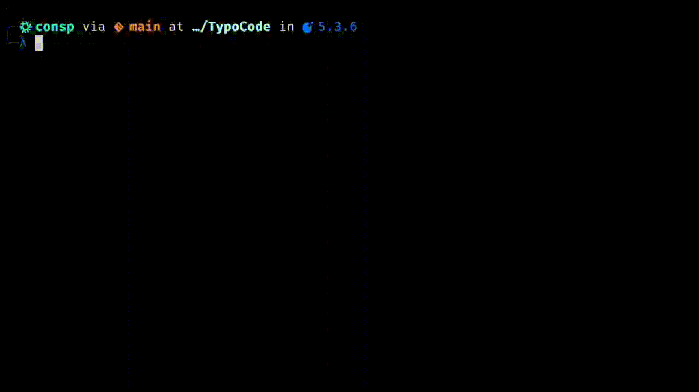

# TypoCode

TypoCode is a very simple terminal-based game where the typing challenges are made of computer science algorithms or source code files provided by the user.
The idea is to help people who are either practicing typing skills or learning programming in general.

The main goal of the game is to be a fun little warm-up before a coding session, something lightweight you can run directly in your terminal, anytime and anywhere.



Note that `TypoCode` requires the following dependencies to be installed on your system to build and run properly:
- **gcc** (or another C compiler)
- **make** (build tool)
- **ncurses**

## Installation

1. Clone the repo:
   ```bash
   git clone https://github.com/Gabriel-c0Nsp/TypoCode.git && cd TypoCode
   ```
2. Build using the `make` command.
   ```bash
   make install
   make clean
   ```
3. After installation, try running TypoCode by typing:
   ```bash
   typo src/typo.c
   ```
